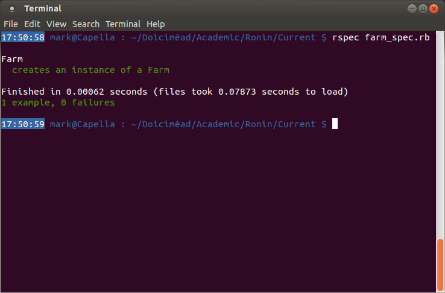

####Writing the first test – Step 2####
Going back to the English description of the project in Step 0, the first thing we outlined was that there was going to be a farm. So lets test that a farm exists:


Another load of errors. Again we can trace the error by looking at the first line of the output:
```
/home/mark/Doiciméad/Academic/Ronin/Current/farm_spec.rb:3:in `<top (required)>':
uninitialized constant Farm (NameError)
```
So on line 3 of our test file there is an `uninitialized constant Farm`. In other words, the test file is looking for a `Farm` class, but can’t find it. So let’s fix that by adding it to our `farm.rb`:


and then rerun the test suite:


No errors, but we still haven’t done any _useful_ testing. All that’s being tested at this point is that there is a declaration of a Farm class in the code.

####Writing the first _real_ test – Step 2½####
Let’s add some more commands to `farm_spec.rb` to test that the Farm class is actually creating instances when it is being initialised:


OK, so what the foobar is going on here? Lines 3 and 7 form a block that describes a class called `Farm`, which should behave in the ways described inside the block. At the moment there is only one behaviour that is being described.

The `it` statement takes in a string as an argument; this string describes in English the behaviour that is expected from the rest of the block.

This leaves a single line that outlines the test to be performed and the expected result. Note the syntax here – this is the ‘newer’ version of the syntax (by newer I mean since 2012, so not all that new!). There are many test suites floating around the Internet that use a much different syntax (see the [Issues Found](../other_issues.md) section for more details), and you _will_ come across them soon if you haven’t done so already. Don’t let this confuse you.

So what does line 5 actually do? Well, it is expecting that the new instance of the Farm created with `Farm.new` is indeed a member of the Farm class. This is equivalent to checking that:

```ruby
Farm.new.is_a?(Farm) == true
```

I know that’s a little contrived – obviously a freshly created Farm instance is going to be a Farm object, but it illustrates the test syntax without getting bogged down in the Ruby code.

So, what happens when `rspec farm_spec.rb` is run?



Yey! A test has been run and passed! Great work!

[← Setting up the test file – Step 1](./writing_tests_step1.md)

[Expanding the Farm tests – Step 3 →](./writing_tests_step3.md)
