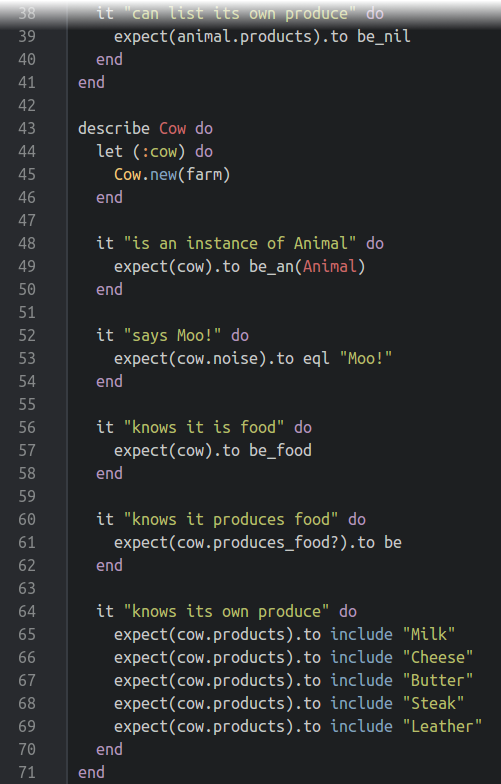
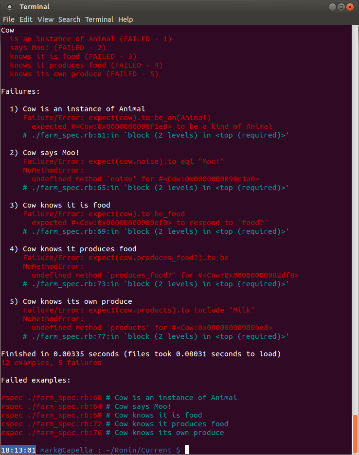
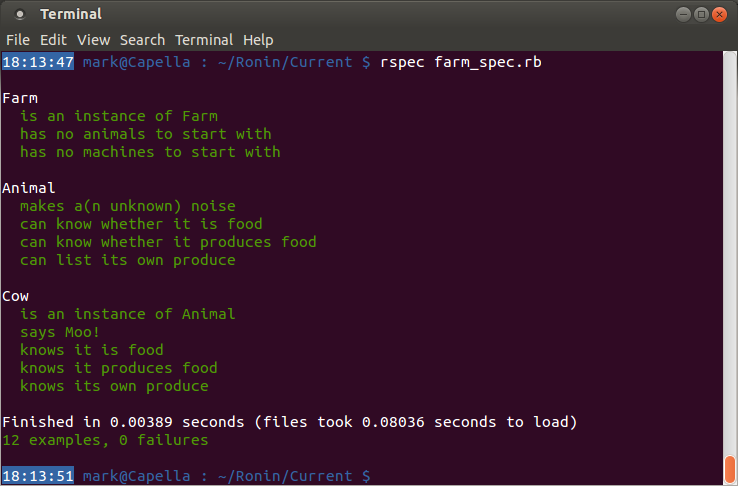

####Extending Animals – Step 5####
Having animals on the Farm is great, but they’re all generic. We can’t tell if they’re edible, or the stuff they produce is edible. So let’s create some specific animals, starting with our beloved Cow:



Before I go on to show you the output of these new tests, let’s stop to discuss a few lines:

```ruby
it "is an instance of Animal" do
  expect(cow).to be_an(Animal)
end
```

This is checking to see that the Cow class extends Animal so that it inherits all of Animal’s attributes. Note the syntax here: I used `be_an(Animal)` whereas in earlier tests I used `be_a(Farm)`. `be_a` and `be_an` are aliases of each other, meaning they both point to the same method. This allows you to check the class of something whilst keeping the English sounding ‘normal’. You could easily say `be_an(Farm)` or `be_a(Animal)` and still get the same results, but the English is hard to say.

```ruby
it "knows it is food" do
  expect(cow).to be_food
end
```

Remember how in Step 2½ (and, in fact, immediately above!) I converted the Ruby method `is_a?` into the RSpec method `be_a`? Well this is pretty much the same idea: `food?` becomes `be_food`. I could easily have said:

```ruby
it "knows it is food" do
  expect(cow.food?).to be
end
```

or even:

```ruby
it "knows it is food" do
  expect(cow.food?).to eq true
end
```

It is worth noting that in addition to the ‘be’ change, there is also a change from ‘has’ to ‘have’; for example the `has_item?` Ruby method becomes `have_item` RSpec test. Relish RSpec has more information on this concept in their [predicate matchers](https://www.relishapp.com/rspec/rspec-expectations/v/3-2/docs/built-in-matchers/predicate-matchers) page.

One further thing to note is that where brackets are optional in Ruby, they are also optional in RSpec. I could easily have written `expect(cow.products).to include("Milk")` on line 65, for example.

After creating a basic, empty Cow class in the `farm.rb` file, the results gained are:



Once again that is a lot of output, but you should have enough information and knowledge to fix the issues yourself. As before, you can use `rspec farm_spec.rb --fail-fast` to address each test one-at-a-time. I have added my solution to the page in case you get stuck, but give it a go yourself first.




Try adding some more animals yourself to experiment. You could add Sheep, Chickens, Sheepdogs, Pigs, Bulls, Camels, Llamas, Giraffes…whatever you like!

[← Adding Animals – Step 4](./writing_tests_step4.md)

[Machinery makes the Farm complete – Step 6 →](./writing_tests_step6.md)
