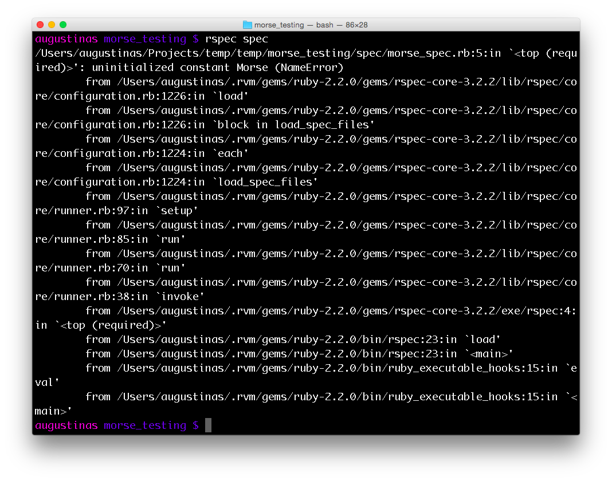

# Testing, Testing, 1, 2, 3... #

#### Step 1 - Making the First Test Pass ####

If everything went right in the previous section, now we should be ready to run some tests. Let's see, try running the following in terminal.

```bash
rspec spec
```
You should get something similar to this:

It looks like nothing is working :-( But if we look carefully, we'll see that RSpec is complaining to us _uninitialized constant Morse (NameError)_ . Well, that basically means that it expects to find a class Morse inside of the program file. Let's add that to the file _morse.rb_ file like so:

```ruby
class Morse

  MORSE_MAP = {"A" => ".-",       "N" => "-.",      1 => ".----",
               "B" => "-...",     "O" => "---",     2 => "..---",
               "C" => "-.-.",     "P" => ".--.",    3 => "...--",
               "D" => "-..",      "Q" => "--.-",    4 => "....-",
               "E" => ".",        "R" => ".-.",     5 => ".....",
               "F" => "..-.",     "S" => "...",     6 => "-....",
               "G" => "--.",      "T" => "-",       7 => "--...",
               "H" => "....",     "U" => "..-",     8 => "---..",
               "I" => "..",       "V" => "...-",    9 => "----.",
               "J" => ".---",     "W" => ".--",     0 => "-----",
               "K" => "-.-",      "X" => "-..-",
               "L" => ".-..",     "Y" => "-.--",
               "M" => "--",       "Z" => "--.."
  }

end
```
Let's <code>rspec spec</code> command again and things will seem to be much better! We've got a list of tests that were run and a report on how many of them were successful and how many failed. For the failed ones we also get detailed information of why they failed. Which is great, because we can use that fail information to work out what is it that brakes those tests and try to find a solution.

It seems that we are required pass an options hash when initializing our Morse object. Let's make that happen now:
```ruby
def initialize(options)

end
```
Run the <code>rspec spec</code> to see if that helps. Ooops! A new error:
_undefined method `string' for #<Morse:0x007fc5bb9b1580>_
Well, we solved the first problem, but now we have a different one. It seems that we are expected to provide a method _string_ in order to be able to retrieve the values that were given to the object. What about this neat code?
```ruby
def string
  @string
end
```
RSpec dully reports that it got back something. But it was't exactly what it expected. Can you work out what the problem is?

If you managed to work it out yourself - great! If not, here's the answer: we need to define an instance variable that will hold the value of the string. Like so:
```ruby
def initialize(options)
  @string = options.fetch(:str)
end

def string
  @string
end
```
Voila! That last tweak allowed us to pass our first test, six to go. Congrats!

Feeling brave? Why not try and pass all of the tests on your own? Common, I know you want to try it.
Still not so sure what is going on? Just read onwards and we'll figure it out!

[Step 0 <----](./morse_0.md)[----> Step 2](./morse_2.md)
