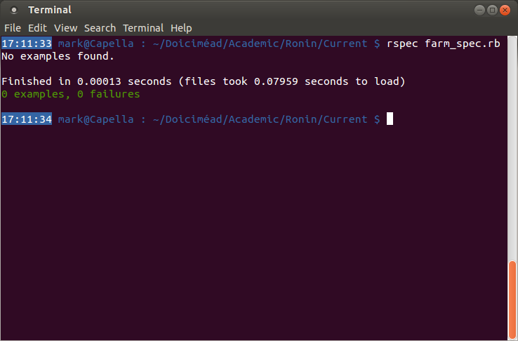

#From Zero to Writing Your Own Tests#
So, now you have some experience developing a programme that conforms to a given set of tests, but what happens if nobody has written the tests yet? Simple, write your own! How? Ahh…

####A little pre-testing setup – Step ‐1####
If you haven’t done so already, I really recommend setting up your RSpec configuration to give you a [colourised output and documentation format](./more_info.md) as these will greatly improve readability of our test responses.

####A little preamble – Step 0####
The next step is defining _what_ you want to test. This step is completed before you get anywhere near writing code. For this example, we are going to have:
- A farm that contains:
  - animals, which:
    - make a noise
    - declare whether they produce foodstuffs
    - declare whether they themselves are food
    - list the products they can make
  - farmyard machines, which:
    - have a certain number of wheels

It would also be wise to keep track of the number of animals and machines present on the farm, you know, so the police can be called if somebody’s lifted something…though I’m really struggling to picture a dudette/dude running down the road with a cow under their arm!

Admittedly this example will not produce code that is particularly intricate, but I want to focus more on building the test statements than the Ruby code itself. I will therefore keep the code relatively simple.

####Setting up the test file – Step 1####
The first step is to create the test file. Normally this will be of the form `classname_spec.rb`, though you can specify whichever name you like. If there are going to be a lot of test files, Ruby code files, or you just want to keep them separate, you can put the file in a subdirectory. The only stipulation is that the test file references your code so that it knows where to apply the tests. So let’s start off by creating a new file called `farm_spec.rb` in your project directory:

```bash
touch farm_spec.rb
```

Using your text editor (Atom, Gedit, Sublime, nano, or, if you’re nuts, vi) open the file and create a reference to our code file (it doesn’t exist yet, but we can make the reference anyway). This will differ depending on the version of Ruby you are using:

```ruby
require 'farm' # Ruby < 1.9.2
require_relative 'farm' # Ruby >= 1.9.2
```

Now run the (very limited) test suite from the terminal:

```bash
rspec farm_spec.rb
```


Well, that doesn’t look good! What happened there? Well, at the very top of the output is a single line:

```
/home/mark/Doiciméad/Academic/Ronin/Current/farm_spec.rb:1:in `require_relative':
cannot load such file -- /home/mark/Doiciméad/Academic/Ronin/Current/farm (LoadError)
```

This is telling you that in line 1 of the `farm_spec.rb` file, there is a Ruby command `require_relative` that failed to execute correctly. Why? Well, it `cannot load such file` called `farm`. This makes sense because we haven’t created it yet. The rest of the output is known as a ‘stack trace’ and outlines all the method calls in all the classes that were running when the `LoadError` occurred. This is not useful to us for this tutorial, but stack traces will be useful for finding errors in your code in future projects, so it is good to know.

So let’s fix this error by creating the `farm.rb` file:

```bash
touch farm.rb
```

and run `rspec` again:

```bash
rspec farm_spec.rb
```


Better! Or is it? It looks like all tests have passed, so can we go home now? No yet: the output tells us `no examples found`. That’s because there are no tests to perform – we haven’t written them yet!

####Writing the first test – Step 2####
Going back to the English description of the project in Step 0, the first thing we outlined was that there was going to be a farm. So lets test that a farm exists:


Another load of errors. Again we can trace the error by looking at the first line of the output:
```
/home/mark/Doiciméad/Academic/Ronin/Current/farm_spec.rb:3:in `<top (required)>':
uninitialized constant Farm (NameError)
```
So on line 3 of our test file there is an `uninitialized constant Farm`. In other words, the test file is looking for a `Farm` class, but can’t find it. So let’s fix that by adding it to our `farm.rb`:


and then rerun the test suite:



No errors, but we still haven’t done any _useful_ testing. All that’s being tested at this point is that there is a declaration of a Farm class in the code.
